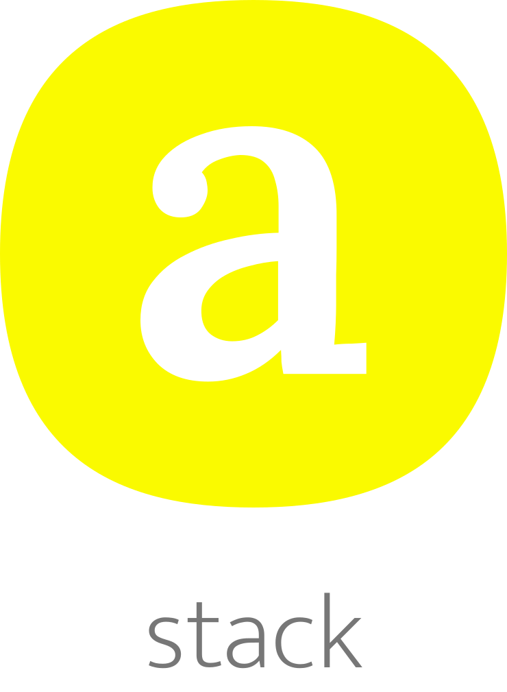

</br >
</br >

<p align='center'>
  <a target='_blank' rel='noopener noreferrer' href='#'>
    
  </a>
</p>

<h1 align='center'>amaui Stack</h1>

<p align='center'>
  Stack
</p>

<br />

<h3 align='center'>
  <sub>MIT license&nbsp;&nbsp;&nbsp;&nbsp;</sub>
  <sub>Production ready&nbsp;&nbsp;&nbsp;&nbsp;</sub>
  <sub>UMD 1.5kb gzipped&nbsp;&nbsp;&nbsp;&nbsp;</sub>
  <sub>100% test cov&nbsp;&nbsp;&nbsp;&nbsp;</sub>
  <sub>Browser and Nodejs</sub>
</h3>

<p align='center'>
  <sub>Very simple code&nbsp;&nbsp;&nbsp;&nbsp;</sub>
  <sub>Modern code&nbsp;&nbsp;&nbsp;&nbsp;</sub>
  <sub>Junior friendly&nbsp;&nbsp;&nbsp;&nbsp;</sub>
  <sub>Typescript&nbsp;&nbsp;&nbsp;&nbsp;</sub>
  <sub>Made with :yellow_heart:</sub>
</p>

<br />

## Getting started

### Add

```sh
  // yarn
  yarn add @amaui/stack

  // npm
  npm install @amaui/stack
```

### Use cases
- Reversing
- Undo/redo
- Backtracking
- Call stack
- etc.

### Use

```javascript
  import AmauiStack from '@amaui/stack';

  // Make a new stack instance
  const amauiStack = new AmauiStack();

  // Add values
  amauiStack.push(1, 2, 3, 4);

  amauiStack.first;
  // 4

  amauiStack.length;
  // 4

  const value = amauiStack.pop();

  value;
  // 4

  amauiStack.first;
  // 3

  amauiStack.length;
  // 3
```

### Dev

Install

```sh
  yarn
```

Test

```sh
  yarn test
```

### Prod

Build

```sh
  yarn build
```

### Docs

Might be soon...
